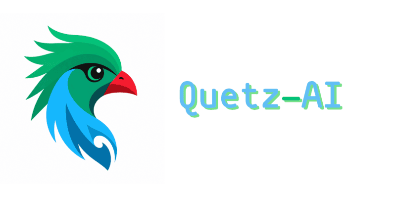
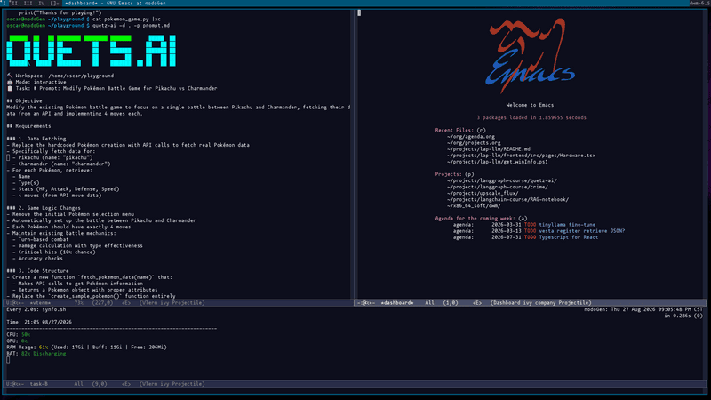

# Quetz-AI

<p align="center">
  
</p>

**A lightweight, Unix-minded AI software engineering agent.**

Minimal context. Local LLMs. 

[Key Features](#key-features) • [Architecture](#architecture) • [Installation](#installation) • [Usage](#usage)

---

## Overview

**Quetz-AI** is a terminal-first autonomous coding assistant designed around the Unix philosophy: do one thing well with low friction and composable design. Built on top of **LangGraph** and powered locally via **Ollama**, Quetz-AI automates code generation, refactoring, and directory operations without bloating your context window.

Unlike heavy agent frameworks that inject thousands of tokens per iteration, Quetz-AI maintains a streamlined system prompt, explicit tool-calling loops, and robust fallback parsers to maximize the efficiency of quantized local models (e.g., Qwen2.5-Coder / Qwen3-Coder).

---

## Key Features

- **Local-First & Private**: Direct integration with `ChatOllama`—no external API keys or cloud dependencies required.
- **Unix Philosophy**: Minimalist system instruction layer that relies on native tool-calling schemas rather than verbose prompt text.
- **LangGraph Orchestration**: Clean state machine implementation (`AgentState`) controlling tool execution, conditional edges, and iteration limits.
- **Robust Tool Parsing**: Native tool call support with regex JSON fallbacks for non-conforming local LLM outputs.
- **Interactive Mode**: Optional human-in-the-loop verification with diff preview (`[d]`) and pager views (`[v]`) before writing or editing files.
- **Workspace Context Detection**: Auto-loads workspace guidelines (`specs.md`, `instructions.md`) when present.

---

<p align="center">
  
</p>

## Architecture

The core architecture follows a cyclic graph state machine:

```
+---------+
|  START  |
+----+----+
     |
     v
+---------+
|  agent  |<------+
+----+----+       |
     |            |
(should_continue)   |
/         \       |
v           v      |
+-------+   +-------+ |
| finish|   | tools |-+
+-------+   +-------+
|
v
+-----+
| END |
+-----+
```

- **`agent_node`**: Formulates execution plans, streams tokens, and emits tool calls.
- **`tools_node`**: Executes disk operations (`read_file`, `write_file`, `edit_file`, `list_dir`, `search`) and returns structured `ToolMessage` payloads.

---

## Installation

### Prerequisites

- Python 3.10+
- Gentoo / Linux / macOS environment
- Running [Ollama](https://ollama.com) instance with a coding model pull (e.g., `qwen2.5-coder:32b` or `qwen3-coder:30b`)

### Setup

```bash
# Clone the repository
git clone https://github.com/your-username/quetz-ai.git
cd quetz-ai

# Initialize virtual environment using uv or venv
uv venv
source .venv/bin/activate

# Install dependencies
uv pip install -e .
```

## Usage

Run quetz-ai inside your project directory:

```bash
# Basic interactive execution
quetz-ai -d /path/to/project -p prompt.md

# Non-interactive / Direct prompt mode
quetz-ai -p "Refactor main.py to use async/await with httpx"
```

### Interactive Tool Confirmation Options

When Quetz-AI proposes file modifications (write_file or edit_file), you can review changes directly from the CLI:

- `[y] Apply`: Execute the modification.
- `[n] Reject`: Abort action and pass user rejection context back to the agent.
- `[v] View`: Open full target file in terminal pager.
- `[d] Diff`: View unified diff of proposed changes before writing to disk.

---

## License

MIT © Oscar Gallardo
